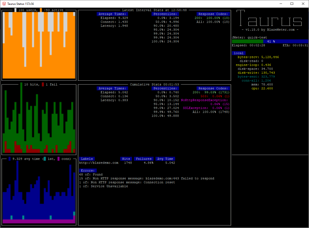

# hello.taurus

Evaluating [Blazemeter/taurus](https://github.com/Blazemeter/taurus) for CI-friendly load testing

## Installation

```console
pip install bzt --user
```

## Simple testing

```console
python -m bzt quick_test.yml
```


